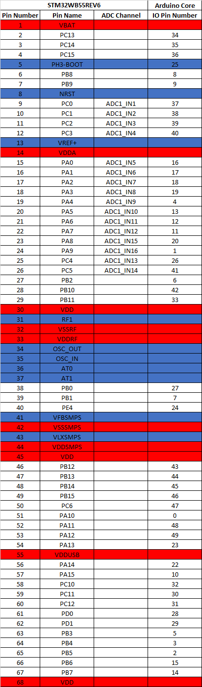

# Arduino Core for STM32WB based boards

## What is it ?

ArduinoCore-stm32wb is targeted at ultra low power scenarios, sensor hubs, with BLE connectivity.


## Supported boards

- <b>LS300-WB55RE </b>(Gemini V2.1): <i>Coming soon! Follow us at <b>[The Things Conference 2022](https://www.thethingsnetwork.org/conference/)</b>!</i>

## Installing

### Board Manager

 1. [Download and install the Arduino IDE](https://www.arduino.cc/en/Main/Software) (at least version v1.8.13)
 2. Start the Arduino IDE
 3. Go into Preferences
 4. Add the following URL as an "Additional Board Manager URL"
 ```
 https://rfthings.github.io/ArduinoBoardManagerJSON/package_rfthings-stm32wb_index.json
 ```

 5. Open the Boards Manager from the Tools -> Board menu and install "RFThings STM32WB Boards"
 6. Select <b>LS300-WB55RE (Gemini V2.1)</b> board from the Tools -> Board menu

#### OS Specific Setup

##### Linux

 1. Go to `~/.arduino15/packages/rfthings-stm32wb/hardware/stm32wb55/<VERSION>/drivers/linux/`
 2. `sudo cp *.rules /etc/udev/rules.d`
 3. reboot

##### Windows

###### STM32 BOOTLOADER driver setup for Tlera Corp boards

 1. Plugin STM32WB board and toggle the RESET button while holding down the BOOT button
 2. Go to `%AppData%` and navigate from to `AppData\Local\Arduino15\packages\rfthings-stm32wb\hardware\stm32wb55\<VERSION>\drivers\windows`
 3. Right-click on `STM32Bootloader.bat` and select `Run as administrator`

###### ST-LINK driver setup for NUCLEO boards

 1. Plugin NUCLEO board
 2. Download and install [ST-Link USB Drivers](http://www.st.com/en/embedded-software/stsw-link009.html)

### From git (for core development)

 1. Follow steps from Board Manager section above
 2. `cd <SKETCHBOOK>`, where `<SKETCHBOOK>` is your Arduino Sketch folder:
  * OS X: `~/Documents/Arduino`
  * Linux: `~/Arduino`
  * Windows: `Documents\Arduino`
 3. Create a folder named `hardware`, if it does not exist, and change directories to it
 4. Clone this repo: `git clone https://github.com/grumpyoldpizza/ArduinoCore-stm32wb.git TleraCorp/stm32wb`
 5. Restart the Arduino IDE

## LS300-WB55RE (Gemini V2.1)

<i>Coming soon! Follow us at <b>[The Things Conference 2022](https://www.thethingsnetwork.org/conference/)</b>.</i>

### Pinmap



### Pin defines (available in core)

| Define | Arduino Pin | Pin Name |
|:-|:-:|:-:|
| LED_BUILTIN | 32 | PC10 |
| LS_LED_BLUE | 32 | PC10 |
| LS_LED | 32 | PC10 |

| Define | Arduino Pin | Pin Name |
|:-|:-:|:-:|
| LS_USER_BUTTON | 33 | PB11 |

| Define | Arduino Pin | Pin Name |
|:-|:-:|:-:|
| E22_BUSY | 27 | PB0 |
| E22_NRST | 16 | PA0 |
| E22_DIO1 | 5 | PB3 |
| E22_NSS | 4 | PA4 |

| Define | Arduino Pin | Pin Name |
|:-|:-:|:-:|
| LS_SKY_ANT | 28 | PD0 |
| LS_SKY_CSD | 29 | PD1 |
| LS_SKY_CTX | 30 | PC11 |
| LS_SKY_CPS | 31 | PC12 |

| Define | Arduino Pin | Pin Name |
|:-|:-:|:-:|
| LS_GPS_ENABLE | 7 | PB1 |
| LS_GPS_V_BCKP | 8 | PB8 |
| LS_GPS_1PPS | 9 | PB9 |

| Define | Arduino Pin | Pin Name |
|:-|:-:|:-:|
| LS_MODULE_ENABLE | 7 | PB1 |
| LS_SD_ENABLE | 26 | PC4 |

| Define | Arduino Pin | Pin Name |
|:-|:-:|:-:|
| LS_BATVOLT_PIN | 40 | PC3 |
| LS_VERSION_MEAS | 39 | PC2 |
| LS_VERSION_ENABLE | 47 | PC6 |

| Define | Arduino Pin | Pin Name |
|:-|:-:|:-:|
| LS_HALL_ENABLE | 24 | PE4 |
| LS_HALL_OUTPUT | 34 | PC13 |

## BLE / Wireless stack firmware installation

 STM32WB uses encrypted/signed firmware images for the BLE stack. Please flash the `FWUpdate` sketch under the `STM32WB` examples before using BLE. The update will take up few seconds/minutes. During that time the LED will stay on, while the serial monitor will say disconnected. When done the LED will blink if the update was succesful, or simply be turned off if an error was encountered. The serial monitor should pop up again and report back the newly updated firmware versions. The `FWInfo` sketch can be used to verify what version is installed. At this time it should report back 1.10.0 for the BLE stack.

## Recovering from a faulty sketch for Tlera Corp Boards

 Sometimes a faulty sketch can render the normal USB Serial based integration into the Arduindo IDE not working. In this case plugin the STM32WB board and toggle the RESET button while holding down the BOOT button and program a known to be working sketch to go ack to a working USB Serial setup.

## Credits

This core is based on the [Arduino SAMD Core](https://github.com/arduino/ArduinoCore-samd)

